# Loïck CHERIMONT

### Backend Java Developer (2026)

---

## 🧠 Focus

Junior Backend Developer focused on **Java / Spring Boot ecosystems**,  
building production-like projects with **clean architecture, testing, and deployment practices**.

---

## 🎯 Objective

I am actively looking for a **Java backend apprenticeship (2026)** in a structured environment where I can:  
- Strengthen Java backend skills  
- Work on real enterprise applications  
- Grow in a production-oriented team  

## 🛠️ My Tools

### Backend

### Testing

### DevOps

### Database

### Frontend

### AI Tools

## 💼 Projects

### Ticketing Application *(IN PROGRESS)*
Support ticket management system (Spring Boot + React).  
[See details](https://github.com/loickcherimont/ticketing-api/tree/main 'Loick CHERIMONT | Ticketing')

### Real-Time Chat Backend API
Spring Boot backend with WebSocket & STOMP for real-time messaging.  
[See details](https://github.com/loickcherimont/springboot-jwt-secure-chat-api 'Loick CHERIMONT | Real-Time Chat API')

### Portfolio Website
Personal portfolio built with React + Spring Boot.  
[Preview](https://loickcherimont.github.io/portfolio 'Loick CHERIMONT | Portfolio')

## 📫 Contact

- [LinkedIn](https://www.linkedin.com/in/loickcherimont 'Loick CHERIMONT | LinkedIn')  
- [Contact me by email](mailto:loickcherimont@gmail.com 'Send email to Loick')  
- [Portfolio](https://loickcherimont.github.io/portfolio 'Loick CHERIMONT | Portfolio')  

---

Copyright © 2026 | Loick CHERIMONT | All Rights Reserved.

